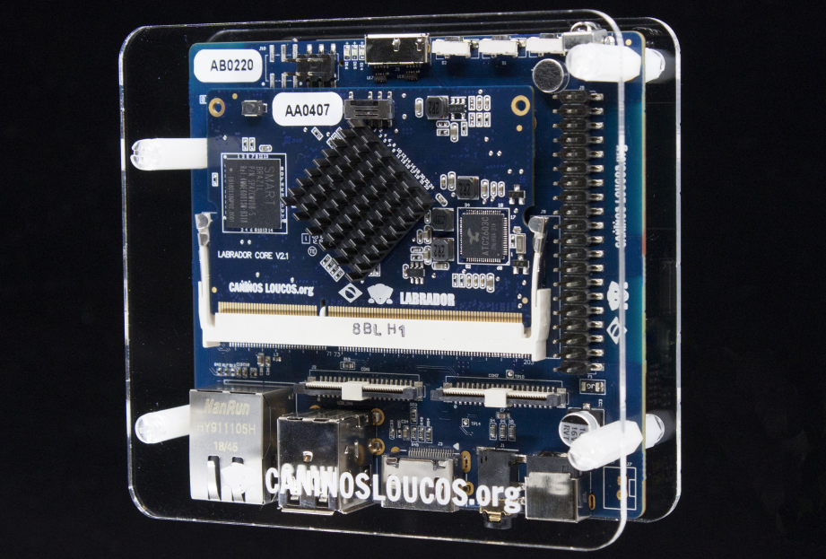
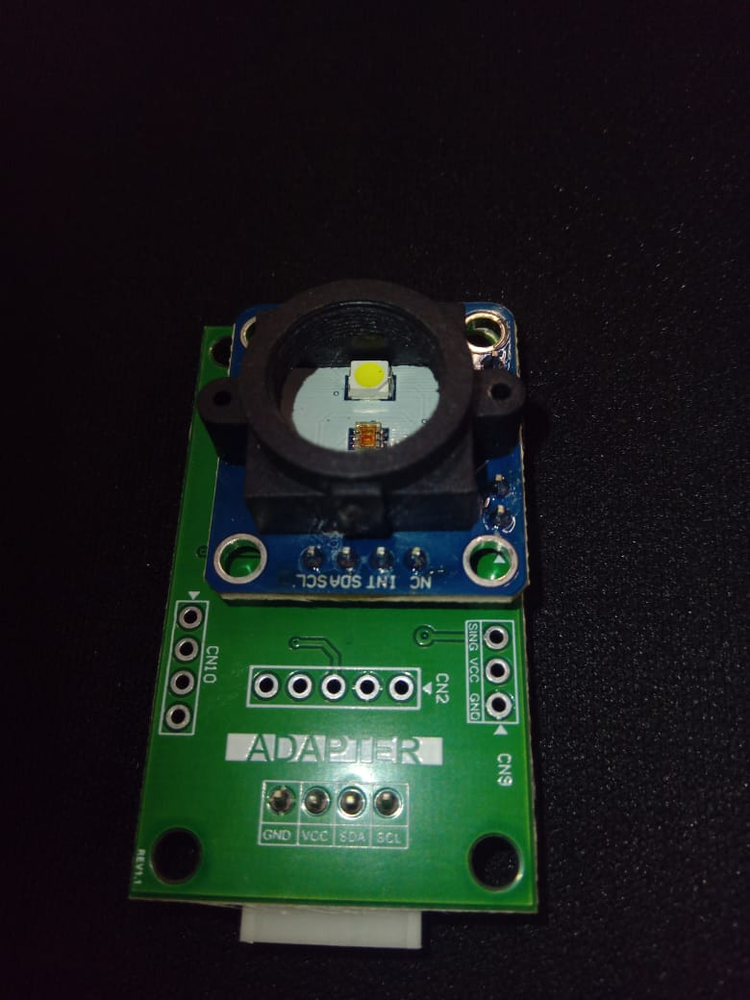

# 🐕‍🦺 Labrador32 Datalogger

Este projeto é um **datalogger multifuncional** desenvolvido para a plataforma **Labrador 32**, capaz de monitorar e registrar dados de diferentes sensores em tempo real, com armazenamento seguro em cartão microSD. O sistema foi pensado para uso educacional e laboratorial, facilitando a coleta e análise de variáveis ambientais e elétricas.

---

## 🚀 Tecnologias Utilizadas

- **🔧 Labrador 32**  
  Microcontrolador utilizado como base do sistema de aquisição, integração com sensores e armazenamento dos dados.

- **💻 Thonny IDE**  
  Ambiente de desenvolvimento utilizado para programação, upload e depuração do código Python na Labrador 32.

- **🐍 Python**  
  Linguagem utilizada para o desenvolvimento do firmware de coleta e registro dos dados.

- **🎨 Sensor de Cor TCS34725**  
  Sensor óptico digital via I2C, utilizado para monitoramento de intensidade de luz nas componentes Clear, Red, Green, Blue e cálculo de Infrared.

- **💾 Cartão microSD**  
  Meio de armazenamento utilizado para salvar os registros das leituras em formato `.txt`.

---

## ⚡ Funcionalidades

- **📊 Coleta de Dados**  
  O sistema realiza a leitura periódica dos sensores conectados à Labrador 32. Atualmente, está implementada a coleta do sensor de cor TCS34725.

- **⏰ Registro com Timestamp**  
  Cada linha do arquivo de log contém a data, hora exata e os valores lidos dos sensores.

- **🔒 Armazenamento Seguro**  
  Os dados são gravados no cartão microSD de forma eficiente, evitando perdas.

- **🔧 Expansível**  
  O sistema pode ser facilmente adaptado para integrar outros sensores, como DHT (temperatura/umidade), ACS712 (corrente), RFID, etc.

---

## 📝 Exemplo de Registro (`log.txt`)

```
[2025-10-01 13:21:29] Clear:2948 Red:1541 Green:1388 Blue:1334 Infrared:0
[2025-10-01 13:21:38] Clear:2952 Red:1542 Green:1389 Blue:1335 Infrared:0
```

---

## 📁 Estrutura do Projeto

```
├── README.md
├── main.py          # Código principal do datalogger
├── log.txt          # Arquivo de registros das leituras (gerado pelo sistema)
├── images/
│   ├── caninos.png       # Imagem da placa Labrador 32
│   └── TCS34725.jpg      # Imagem do sensor de cor TCS34725
```

---

## 🖼️ Imagens

### 🐕‍🦺 Placa Labrador 32


### 🎨 Sensor de Cor TCS34725


---

## 🛠️ Como Usar

1. **🔌 Conecte** o sensor TCS34725 à Labrador 32
2. **💾 Insira** o cartão microSD na placa
3. **📤 Faça upload** do arquivo `main.py` usando o Thonny IDE
4. **▶️ Execute** o sistema
5. **📊 Os dados** serão registrados no arquivo `log.txt` no cartão microSD

---

## 🔮 Futuras Expansões

- 🌡️ Integração de novos sensores (DHT11/DHT22, ACS712, RFID, etc.)
- 🖥️ Interface gráfica ou web para visualização dos dados em tempo real
- ⚙️ Configuração fácil do intervalo de coleta
- 📡 Exportação automática dos dados via rede sem fio

---

## 📌 Observações

- 🚧 Projeto em desenvolvimento. Novas funcionalidades serão adicionadas!
- ❓ Para dúvidas ou sugestões, consulte o professor ou colaboradores do laboratório

---

## 📄 Licença

Projeto de caráter educacional, livre para uso acadêmico.